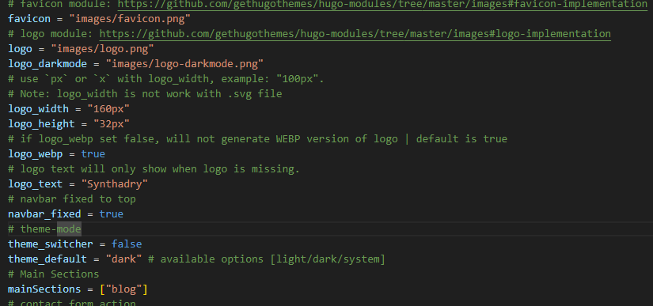

# Проектная (учебная) практика
# Базовая часть (Документация по созданию статического сайта)

## Введение
Документация описывает процесс разработки статического сайта, созданного в рамках базовой части проектной практики. Сайт содержит основную информацию о проекте, его участниках, ходе выполнения и ресурсах.

- **Формат создания сайта:** Использование генератора статических сайтов Hugo 
- **Репозиторий:** [Папка site](https://github.com/QwArs56/Practice/tree/main/site)
- **Стек технологий:** HTML, CSS и JavaScript

---

## Структура сайта

### Основные страницы:

| Страница | Назначение |
|----------|------------|
| Главная | Страница с аннотацией проекта |
| О проекте | Описание проекта и его цели, задачи, проблематика и т.д.|
| Команда | Команда проекта, какова роль каждого участника|
| Журнал | Страница со статьями о проделанной работы |
| Ресурсы | Полезные ссылки, источники, партнёры |

---

## Процесс разработки

### 1. Установка Hugo и начало работы 
Прежде чем начать работу с самим сайтом, необходиомо установить Hugo и Git 
Для работы над сайтом использовался сайт с [введением в работу на Hugo](https://gohugo.io/getting-started/quick-start/). С его помощью была произведена первоначальная установка всех необходимых компанентов

#### Выбор темы для сайта
Первоначально по руководству используется тема "Ananke", но учитывая общую стилистику проекта, было решено взять за основу тему "Hugoplate" и редактировать её. ([Демо темы](https://hugoplate.netlify.app))

Начало работы с Hugo(быстрое создание сайта и выбор темы):
```
hugo new site quickstart
cd quickstart
git init
git submodule add https://github.com/zeon-studio/hugoplate
echo "theme = 'hugoplate'" >> hugo.toml
hugo server
```
### 2. Создание структуры сайта
После того как все было подготовлено, необоходимо было определить структуру сайта. Первоначально структура сайта имела главные страницы (страницы, расплогающиеся в header) и дочерние страницы (страницы, распологающиеся в меню header). Так как требовалось создать всего 5 страниц, было принято решение сделать все эти страницы главными с быстрым доступом из header.

Чтобы это реализовать нужно отредактировать файл [**config/_default/menus.en.toml**](https://github.com/QwArs56/Practice/blob/main/site/config/_default/menus.en.toml):


Также нужно было убрать ненужные элементы, которые предусмотренны темой, например поиск по сайту, смена темы, так как это могло отквлекать пользователя и не иметь никакого значения. Чтобы это реализовать тобы это реализовать нужно отредактировать файл [**params.toml**](https://github.com/QwArs56/Practice/blob/main/site/config/_default/params.toml):



В дальнейшем нужно было поработать с каждой страницей и убрать ненужные элементы.
Рассмотрим это напримере страницы с командой:
Первоначально страница предоставляет большое количесвто информации о каждом участнике: его фотографию, ссылки на соц. сети, описание, также можно перейти на его личную страницу на сайте и узнать подробнее о нем. Так как проект небольшой и выполняется в рамках Проектной деятельности нет необходимости охнакомливаться с фотографиями участников или же с их соц.сетями\портфолио(так как у некоторых его просто может быть). Исходя из этого было решено убрать все ненужное, оставив лишь описание и имя.
Все файлы HTML храняться в папке [layouts](https://github.com/QwArs56/Practice/tree/main/site/themes/hugoplate/layouts), там же находиться нужный файл [author-card.html](https://github.com/QwArs56/Practice/tree/main/site/themes/hugoplate/layouts/partials/components)

 Отредактировав файл, получаем новый вид карточке для каждого участника проекта:


 По такому же принципу были отредактированы остальные страницы сайта, после чего он был полностью готов к написанию контента и наполнением его нужными изображениями.

### 3. Наполнение сайта изображениями и контентом 

#### Текст
Весь контент на сайте был написан с помощью языка для разметки Markdown. Для работы с контентом Hugo предаставляет отдельную папку [**content**](https://github.com/QwArs56/Practice/tree/main/site/content/english), где содержаться все файлы типа .md для работы с наполнением сайта. Также по мимо работы с текстом к некоторым блокам сайта прикреплены изображения, которые находяться в папке [**images**](https://github.com/QwArs56/Practice/tree/main/site/assets/images), там храняться необохдимые изображения и файлы, как для сайта в целом(лого, фавикон и т.д), так и изображения для постов. 

#### Изображения 
Как было сказано ранее, в папке **images**  представлены все нужные изображения для темы, но не все эти изображения подходили под тему проекта. Поэтому, используя Photoshop были, были нарисованны новый фавикон, изображения для лого, а тажке изображения, что распологаются на главной странице.

Остальные изображения, например те, что прдесталвены в постах на странице Журнал, добавлялись на страницы с помощью языка разметки Markdown.


Напримере одного поста можно ознакомиться с работой над заполнением сайта:
1) Прописываем первоначальную информацию(название, изображение которое нужно использовать для обложки)
2) Прописываем текст с использованием языка разметки Markdown
3) Добавялем необохдимые изображения

### 4. Используемые инструменты

В работе над проектом были использованы такие истуременты как:
1) Генератор статических вебсайтов Hugo
2) Технология Git и сайт GitHub для выгрузки проекта в общедоступный репозиторий 
3) Photoshop для работы с изображениями на сайте
4) Visual Studio для работы с кодом и написания контента для сайта


# Вариативная часть задания
## Введение

Документация описывает процесс реализации технологии для вариативной части задания.

- **Формат реализации технологии** Написание игры Тетрис на языке С++
- **Репозиторий:** [Папка site](https://github.com/QwArs56/Practice/tree/main/site)
- **Стек технологий:** язык C++, также расширения SDL 1.2 и SDL_gfx

Обзор: Tetris — классическая аркадная игра, где игрок управляет падающими фигурами (тетромино), стремясь заполнить горизонтальные линии без пропусков. 
Почему именно реализация этой технологии? Я выбрал именно создание игры Tetris поскольку провел очень много времени в этой игре и считаю её достаточно интересной и увлекательной.

2. Требования
Инструменты разработки: Visual Studio 2022
Расширения: SDL 1.2, SDL_gfx 1.2.

## Окружение и структура проекта 
Simple DirectMedia Layer (SDL) — свободная кроссплатформенная мультимедийная библиотека, реализующая единый программный интерфейс к графической подсистеме, звуковым устройствам и средствам ввода для широкого спектра платформ. Данная библиотека активно используется при написании кроссплатформенных мультимедийных программ (в основном игр).

Tetris/
├─ Main.cpp (WinMain) - основной файл 
├─ IO.cpp, IO.h - файлы для работы с графикой
├─ Pieces.cpp, Pieces.h - файлы для создания тетромино
├─ Board.cpp, Board.h - файлы для настройки игрового поля
└─ Game.cpp, Game.h - файлы для создание логики игры и её игрового цикла

## Реализация компонентов

### Создание фигур 

Для начала треубется создать класс для хранения всех фигур. Всего в тетрисе 7 фигур:
1) I-образная
2) L-образная 
3) J-образная (отраженная L-образная)
4) Z-образная
5) S-образная (отраженная Z-образная)
6) T-образная
7) Квадрат
 
Самую длинную сторону имеет I-образная и она достигает 4 блока. Для хранения всех этих фигур нужно создатть матриу 5 на 5, где будем записывать все возможные состояния фигур. 


Матрица 5 на 5 выбрана, так как фигуры в тетрисе нужно вращать. Например I-образная имеет всего 4 блока, то есть не имеет блока, который бы являелся центральным, чтобы вращать фигуру относительно него. Таким образом нужно взять один из двух центральных блоков в качестве центра вращения. Озоначим этот блок типом 2. Тогда имеем:
1) Блок типа 0 - отсутсвие блока 
2) Блок типа 1 - простой блок 
3) Блок типа 2 - блок вращения
Исходя из этого получается, что вращаясь относительно блока вращения I-образная будет занимать площадь, которую можно представить в виде матрицы 5 на 5. При матрице 4 на 4 фигура смещалась, что мешало бы играть. 

Таким образом в классе нужно прописать все состояния(все 4 вариации поворота) для всех 7 фигур. 


После того, как это было сделано, нужно правильно разместить новый падающий тетрамино на игровом поле. Он должен появляться на самой первой строчке игрового поля, то есть марица с блоком должна уходить чуть выше, чтобы заполненные блоки(типа 1 или 2) появлялись на самом верху, а не ниже. Для этого нужно создать отдельный класс, где будут прописаны отступы для каждого блока при кадом состоянии. В этом классе нужно оказать отступ в координатах X и Y:


Далее в файле Piece.h прописываем класс, в котором будет 3 метода

1) GetBlockType: возвращает тип блока (0/1/2).
2) GetXInitialPosition: начальные смещения по оси X 
3) GetYInitialPosition: начальные смещения по оси Y 


### Игровое поле и столкновения
После того как было создан тетрамино, нужно создать игровое поле и прописать принципы его работы. Для этого создаем файлы `Board.cpp` и `Board.h`.

Класс Board отвечает за внутреннее представление игровой доски. Он реализует двумерный массив из ячеек (блоков), где хранятся упавшие фигуры, и предоставляет методы для:
- проверки возможности движения фигуры
- хранения упавших фигур
- удаления заполненных линий
- проверки окончания игры
- получения координат блоков в пикселях для отрисовки

Для начала задаем параметры в файлк `Board.h`, с помощью которых будем опредлять положение игрового поля в окне. 

```cpp
#define BOARD_LINE_WIDTH 6         // Ширина каждой из двух линий, которые ограничивают игровое поле
#define BLOCK_SIZE 16             // Ширина и высота каждого блока фигуры
#define BOARD_POSITION 110        // Центр игрового поля от левого края экрана
#define BOARD_WIDTH 10            // Ширина игрового поля в блоках
#define BOARD_HEIGHT 20           // Высота игрового поля в блоках
#define MIN_VERTICAL_MARGIN 20    // Мин вертикальный отступ от границы игрового поля
#define MIN_HORIZONTAL_MARGIN 20 // Мин горизонтальный отступ от границы игрового поля
#define PIECE_BLOCKS 5            // Число горизонтальных и вертикальных блоков в матрице фигуры
```

Основные пареметры это `BOARD_WIDTH` и `BOARD_HEIGHT` - на их основе заполнентся игровое пространство с помощью пустых блоков, то есть блоками типа 0. Это используется в массиве, для хранения информации о каждом блоке на игровом поле:

**Двумерный массив** `mBoard[BOARD_WIDTH][BOARD_HEIGHT]` хранит состояние каждого блока:
* `POS_FREE` (0) — ячейка пуста
* `POS_FILLED` (1) — ячейка занята частью фигуры

Далее мы создаем конструктор Board, который сохраняет ссылку на объект Pieces и высоту экрана для подсчета координат блоков
```cpp
 Board(Pieces *pPieces, int pScreenHeight);
```
Далее иницилизируем общие и приватные методы и другие объекты для работы с игровым полем.

Для этого прописываем их в файле `Board.h`:

**InitBoard()**
- Проходит по всем ячейкам массива и ставит их в состояние **свободно**.
- Позволяет начать игру с пустой доски.

--- 

Затем прописываем фунцию для хранения информации о уже упавших блоках. Для этого прописываем функцию `StorePiece`
**StorePiece(pX, pY, pPiece, pRotation)**
Принимая в себя координаты, тип тетрамино и ее состояние(одна из 4х позиций вращения), функция: 
* Перебирает матрицу 5×5 выбранной фигуры (класс `Pieces`)
* Для каждого непустого элемента записывает `POS_FILLED` в соответствующую ячейку `mBoard[pX + i][pY + j]`

---

Функция `IsGameOver()` нужня для того, чтобы опредлить занята ли хотя бы одна яцейка в самой верхней строке, если  больше некуда ставить новые фигуры — игра окончена

```cpp
for (int x = 0; x < BOARD_WIDTH; x++)
    if (mBoard[x][0] == POS_FILLED) return true;
```
---

Вместе с окончание игры нужно прописать функции для того, чтобы игра продложалась, то есть удалялись полностью заполненные линии. Для этого прописываем две функции:

`DeletePossibleLines()`
* Скользит по каждой строке `j` от 0 до `BOARD_HEIGHT–1`
* Если в строке все ячейки равны `POS_FILLED`, вызывает

`DeleteLine(pY)`
* Для строки `pY` смещает все **строки выше** вниз на одну позицию
* Верхняя строка после этого остаётся пустой

--- 

Также пропишем небольшую функцию `FreeBlock`, которая будет возвращать все иформацию о заполненности проходимого блока
```cpp
if (mBoard [pX][pY] == POS_FREE) return true; else return false;
```
--- 

Затем чтобы отрисовать ячейку на экране, нужен её адрес в пикселях, для этого задем следующие функции: 

- **GetXPosInPixels(pPos)**
  Вычисляет горизонтальную позицию блока по формуле:

  ``` cpp 
  pixelX = BOARD_POSITION – (BLOCK_SIZE * (BOARD_WIDTH / 2)) + pPos * BLOCK_SIZE
  ```
  где `BOARD_POSITION` — центр поля на экране, `BLOCK_SIZE` — размер одного блока в пикселях.

- **GetYPosInPixels(pPos)**
  Аналогично рассчитывает вертикальную координату:

  ```cpp 
  pixelY = mScreenHeight – (BLOCK_SIZE * BOARD_HEIGHT) + pPos * BLOCK_SIZE
  ```
---

**IsPossibleMovement(pX, pY, pPiece, pRotation)**

Метод сравнивает все блоки фигуры с блоками, уже сохраненными на доске, и с границами доски. Метод работает по следующему принцепу
* Пробегает по 5×5 области фигуры, смещённой на (`pX`, `pY`)
* Для каждого непустого блока:
  1. Проверяет, выходит ли он **за границы** поля — если да, движение запрещено.
  2. Если блок попадает внутрь поля, проверяет `IsFreeBlock(x, y)` — свободна ли ячейка.
* Возвращает **false** при любом обнаруженном конфликте, иначе **true**.


### Реализация игрового процесса (Game)

Класс `Game` объединяет логику всех компонентов и управляет основным циклом Tetris:
- инициализирует первые и “следующие” фигуры,
- отслеживает положение текущей фигуры,
- обрабатывает случайную генерацию новых тетромино,
- рисует игровую сцену (поле + текущая и следующая фигуры),
- взаимодействует с модулем `Board` (коллизии, хранение) и `IO` (отрисовка, ввод).


Pаботаем с  файлом `Board.cpp`: 

Сперва пропишем конструктор класса: 
```cpp
Game::Game(Board* pBoard, Pieces* pPieces, IO* pIO, int screenH) {
  mBoard        = pBoard;
  mPieces       = pPieces;
  mIO           = pIO;
  mScreenHeight = screenH;
  InitGame();
}
```
Этот консруктор важен, поскольку он вызывает InitGame(), который:
- Инициализирует генератор srand(time(NULL)).
- Выбирает случайный тип/поворот для текущей фигуры.
- Рассчитывает её стартовые координаты:

```cpp 
mPosX = BOARD_WIDTH/2 + mPieces->GetXInitialPosition(...);
mPosY = mPieces->GetYInitialPosition(...);
```
Аналогично генерирует следующую фигуру и задаёт mNextPosX, mNextPosY.
---

**GetRand(int pA, int pB)**
Возвращает случайное целое число в диапазоне от pA до pB включительно. Используется для генерации случайных фигур и их поворотов.

```cpp
int Game::GetRand(int pA, int pB) {
  return rand() % (pB - pA + 1) + pA;
}
```
---
**CreateNewPiece()**
Устанавливает текущую фигуру на ту, которая была следующей, и рассчитывает её начальные координаты. Затем случайным образом выбирается новая "следующая" фигура и её поворот.

```cpp 
void Game::CreateNewPiece() {
  // Текущая становится “следующей”
  mPiece    = mNextPiece;
  mRotation = mNextRotation;
  mPosX     = BOARD_WIDTH/2 + mPieces->GetXInitialPosition(mPiece,mRotation);
  mPosY     = mPieces->GetYInitialPosition(mPiece,mRotation);

  // Генерируем новую “следующую”
  mNextPiece    = GetRand(0,6);
  mNextRotation = GetRand(0,3);
}
```
---
**DrawPiece(pX, pY, pPiece, pRotation)**
Отрисовывает заданную фигуру на экране в указанных координатах и повороте. Цвет выбирается из массива по типу фигуры. Каждый блок фигуры рисуется отдельно, если он непустой (значение 1 или 2 в шаблоне фигуры).

```cpp 
const color pieceColors[7] = { RED, GREEN, BLUE, CYAN, MAGENTA, YELLOW, WHITE };

void Game::DrawPiece(int pX, int pY, int pPiece, int pRotation)
{
  // Выбираем цвет фигуры по типу
  color mColor = pieceColors[pPiece];

  // Получаем позицию фигуры на экране
  int mPixelsX = mBoard->GetXPosInPixels(pX);
  int mPixelsY = mBoard->GetYPosInPixels(pY);

  // Рисуем каждый блок фигуры
  for (int i = 0; i < PIECE_BLOCKS; i++) {
    for (int j = 0; j < PIECE_BLOCKS; j++) {
      // Проверка, есть ли блок в этом месте (1 или 2)
      if (mPieces->GetBlockType(pPiece, pRotation, j, i) != 0) {
        mIO->DrawRectangle(
          mPixelsX + i * BLOCK_SIZE,
          mPixelsY + j * BLOCK_SIZE,
          (mPixelsX + i * BLOCK_SIZE) + BLOCK_SIZE - 1,
          (mPixelsY + j * BLOCK_SIZE) + BLOCK_SIZE - 1,
          mColor
        );
      }
    }
  }
}

```
---

**DrawBoard()**
Отрисовывает игровое поле. Сначала рисуются синие границы по бокам, затем все занятые блоки поля окрашиваются в красный.

```cpp
void Game::DrawBoard() {
  int left  = BOARD_POSITION - BLOCK_SIZE*(BOARD_WIDTH/2);
  int right = left + BLOCK_SIZE*BOARD_WIDTH;
  int topY  = mScreenHeight - BLOCK_SIZE*BOARD_HEIGHT;

  // Границы поля
  mIO->DrawRectangle(left-BOARD_LINE_WIDTH, topY, left, mScreenHeight-1, BLUE);
  mIO->DrawRectangle(right,           topY, right+BOARD_LINE_WIDTH, mScreenHeight-1, BLUE);

  // Уже упавшие блоки
  for(int x=0;x<BOARD_WIDTH;++x)
    for(int y=0;y<BOARD_HEIGHT;++y)
      if(!mBoard->IsFreeBlock(x,y))
        mIO->DrawRectangle(left+x*BLOCK_SIZE, topY+y*BLOCK_SIZE,
                           left+(x+1)*BLOCK_SIZE-1, topY+(y+1)*BLOCK_SIZE-1,
                           RED);
}

```
---

**DrawScene()**
Отрисовывает полную игровую сцену: поле, текущую падающую фигуру и следующую фигуру. Вызывается каждый кадр для обновления экрана.

```cpp
void Game::DrawScene() {
  DrawBoard();
  DrawPiece(mPosX,    mPosY,    mPiece,    mRotation);
  DrawPiece(mNextPosX,mNextPosY,mNextPiece,mNextRotation);
}
```

### Отрисовка игры (IO)

Класс IO отвечает за визуализацию и пользовательский ввод в Tetris. Он использует библиотеку SDL для отображения графики и обработки событий клавиатуры.
- Среди основных обязанностей:
- Инициализация графического окна SDL (InitGraph);
- Отрисовка фигур и элементов интерфейса (DrawRectangle);
- Очистка экрана и обновление изображения (ClearScreen, UpdateScreen);
- Получение ввода с клавиатуры: опрос событий (Pollkey), ожидание клавиши (Getkey), проверка состояния клавиш (IsKeyDown);
- Предоставление информации о размере экрана (GetScreenHeight).
- Этот класс используется в Game для рисования поля, фигур и управления пользователем.

**Конструктор класса IO.**
Вызывает инициализацию графической подсистемы с помощью метода `InitGraph()`.

```cpp
IO::IO() {
	InitGraph();
}
```

---

**ClearScreen()**
Очищает экран, заполняя его черным цветом.

```cpp
void IO::ClearScreen() {
	boxColor(mScreen, 0, 0, mScreen->w - 1, mScreen->h - 1, mColors[BLACK]);
}
```

---

**DrawRectangle(pX1, pY1, pX2, pY2, pC)**

Рисует прямоугольник заданного цвета.
Аргументы: координаты углов и цвет прямоугольника.

```cpp
void IO::DrawRectangle(int pX1, int pY1, int pX2, int pY2, enum color pC) {
	boxColor(mScreen, pX1, pY1, pX2, pY2 - 1, mColors[pC]);
}
```

---

**GetScreenHeight()**

Возвращает высоту текущего экрана.

```cpp
int IO::GetScreenHeight() {
	return mScreen->h;
}
```

---

**UpdateScreen()**
Обновляет экран, отображая все отрисованные элементы.

```cpp
void IO::UpdateScreen() {
	SDL_Flip(mScreen);
}
```

---

**Pollkey()**
Считывает нажатие клавиши, не ожидая ввода. Если нажата клавиша — возвращает её код. Если окно закрыто — завершает программу.

```cpp
int IO::Pollkey() {
	SDL_Event event;
	while (SDL_PollEvent(&event)) {
		switch (event.type) {
			case SDL_KEYDOWN:
				return event.key.keysym.sym;
			case SDL_QUIT:
				exit(3);
		}
	}
	return -1;
}
```

---

**Getkey()**
Ожидает нажатия клавиши и возвращает её код. Если окно закрыто — завершает программу.

```cpp
int IO::Getkey() {
	SDL_Event event;
	while (true) {
		SDL_WaitEvent(&event);
		if (event.type == SDL_KEYDOWN)
			break;
		if (event.type == SDL_QUIT)
			exit(3);
	}
	return event.key.keysym.sym;
}
```

---

**IsKeyDown(pKey)**
Проверяет, удерживается ли клавиша с кодом `pKey`.

```cpp
int IO::IsKeyDown(int pKey) {
	Uint8* mKeytable;
	int mNumkeys;
	SDL_PumpEvents();
	mKeytable = SDL_GetKeyState(&mNumkeys);
	return mKeytable[pKey];
}
```

---

**InitGraph()**
Инициализирует графическую подсистему SDL и создает окно. Возвращает 0 при успехе или код ошибки при неудаче.

```cpp
int IO::InitGraph() {
	const SDL_VideoInfo *info;
	Uint8  video_bpp;
	Uint32 videoflags;

	if (SDL_Init(SDL_INIT_VIDEO) < 0) {
		fprintf(stderr, "Couldn't initialize SDL: %s\n", SDL_GetError());
		return 1;
	}
	atexit(SDL_Quit);

	info = SDL_GetVideoInfo();
	video_bpp = (info->vfmt->BitsPerPixel > 8) ? info->vfmt->BitsPerPixel : 16;
	videoflags = SDL_SWSURFACE | SDL_DOUBLEBUF;

	if ((mScreen = SDL_SetVideoMode(400, 400, video_bpp, videoflags)) == NULL) {
		fprintf(stderr, "нельзя установить %ix%i разрешение: %s\n", 500, 600, SDL_GetError());
		return 2;
	}
	return 0;
}
```

### Главный цикл игры 
Файл Main.cpp запускает игру, инициализируя все необходимые компоненты и реализуя главный игровой цикл. Внутри него происходит отрисовка, обработка ввода и логика вертикального движения и падения фигур.

Каждый кадр:
- очищает экран
- отрисовывает игровую сцену (поле, текущая фигура, следующая фигура)
- обрабатывает ввод с клавиатуры (движение, вращение, ускорение падения)
- управляет автоматическим падением фигуры по таймеру
- завершает игру, если поле заполнено до верха


**Инициализация классов**
Создаются объекты всех ключевых компонентов игры: IO (графика и ввод), Pieces (фигуры), Board (игровое поле) и Game (игровая логика). Также сохраняется текущее время для контроля интервалов автоматического падения фигур.

```cpp
#include "Game.h"
#include <windows.h>


int WINAPI WinMain(HINSTANCE hInstance, HINSTANCE hPrevInstance, LPSTR lpCmdLine, int nCmdShow) {
    IO mIO;
    int mScreenHeight = mIO.GetScreenHeight();

    Pieces mPieces;
    Board mBoard(&mPieces, mScreenHeight);
    Game mGame(&mBoard, &mPieces, &mIO, mScreenHeight);

    unsigned long mTime1 = SDL_GetTicks();
```
**Основной цикл**

Главный цикл продолжается, пока не нажата клавиша ESC. Каждый кадр:
- очищает экран
- рисует игровую сцену
- обновляет окно (выводит изображение)

```cpp 
  while (!mIO.IsKeyDown(SDLK_ESCAPE)) {
      mIO.ClearScreen();
      mGame.DrawScene();
      mIO.UpdateScreen();
```

**Обработка ввода**
Позволяет игроку перемещать фигуру влево, вправо и вниз, если движение возможно. Проверка коллизий выполняется перед каждым сдвигом.

```cpp
int mKey = mIO.Pollkey();

switch (mKey)
{
//Правая клавиша
case (SDLK_RIGHT):
{
	// Проверка, можно ли переместить фигуру вправо
	if (mBoard.IsPossibleMovement(mGame.mPosX + 1, mGame.mPosY, mGame.mPiece, mGame.mRotation))
		mGame.mPosX++;
	break;
}

//Левая клавиша
case (SDLK_LEFT):
{
	// Проверяем, можно ли переместить фигуру влево
	if (mBoard.IsPossibleMovement(mGame.mPosX - 1, mGame.mPosY, mGame.mPiece, mGame.mRotation))
		mGame.mPosX--;
	break;
}

//Клавиша вниз
case (SDLK_DOWN):
{
	// Проверяем, можно ли переместить фигуру вниз
	if (mBoard.IsPossibleMovement(mGame.mPosX, mGame.mPosY + 1, mGame.mPiece, mGame.mRotation))
		mGame.mPosY++;
	break;
}
```

**Быстрое падение фигуры (клавиша X)**

Фигура мгновенно падает до самой нижней возможной позиции. Затем:
- сохраняется на поле
- проверяются и удаляются заполненные строки
- проверяется условие завершения игры
- создаётся новая фигура

```cpp 
case (SDLK_x):
{
	// Проверяем, можно ли перемещать фигуру до самого низа
	while (mBoard.IsPossibleMovement(mGame.mPosX, mGame.mPosY, mGame.mPiece, mGame.mRotation)) {
		mGame.mPosY++;  // Опускаем фигуру до первого препятствия
	}

	// Сохраняем фигуру в игровом поле
	mBoard.StorePiece(mGame.mPosX, mGame.mPosY - 1, mGame.mPiece, mGame.mRotation);

	
	mBoard.DeletePossibleLines();// Удаляем заполненые линии

	if (mBoard.IsGameOver())
	{
		mIO.Getkey();  // Ожидаем нажатие клавиши
		exit(0);
	}

	// Создаем новую фигуру
	mGame.CreateNewPiece();
	break;
}
```

**Вращение фигуры (клавиша Z)**

Фигура вращается по часовой стрелке, если поворот возможен без коллизии.

```cpp
case (SDLK_z):
{
	// Проверяем, можно ли повернуть фигуру
	if (mBoard.IsPossibleMovement(mGame.mPosX, mGame.mPosY, mGame.mPiece, (mGame.mRotation + 1) % 4))
		mGame.mRotation = (mGame.mRotation + 1) % 4;//Поварачиваем фигуру(меняем ее состояние)
	break;
}
```
**Автоматическое падение**

Если прошло заданное количество миллисекунд (WAIT_TIME), фигура автоматически сдвигается вниз. Если движение возможно, координата Y увеличивается, иначе фигура сохраняется, удаляются строки, проверяется завершение игры, создаётся новая фигура

```cpp
// Получаем текущее время для отслеживания интервала
unsigned long mTime2 = SDL_GetTicks();

// Если прошло достаточно времени (по таймеру)
if ((mTime2 - mTime1) > WAIT_TIME)
{
  // Проверяем, можно ли переместить фигуру вниз
  if (mBoard.IsPossibleMovement(mGame.mPosX, mGame.mPosY + 1, mGame.mPiece, mGame.mRotation))
  {
    mGame.mPosY++;
  }
  else
  {
    // Сохраняем фигуру в игровом поле
    mBoard.StorePiece(mGame.mPosX, mGame.mPosY, mGame.mPiece, mGame.mRotation);
    mBoard.DeletePossibleLines();

    if (mBoard.IsGameOver())
    {
      mIO.Getkey();  
      exit(0);
    }

    mGame.CreateNewPiece();
  }

  
  mTime1 = SDL_GetTicks(); // Обновляем время для следующего движения
}
}
return 0;
```


После всего этого, можно делать сборку всех файлов и запускать игру.